# 基于springboot的视频网站系统

#### 介绍

在当今数字化时代，视频内容已成为人们获取信息和娱乐的重要方式。各类视频网站层出不穷，为用户提供了丰富多样的视听体验。然而，现有的视频网站仍存在一些问题和局限性，例如内容审核不够严格、用户管理不够精细、视频排名算法不够合理、交流互动功能不够完善等。

#### 技术栈

后端技术栈：Springboot+Mysql+Maven

前端技术栈：Vue+Html+Css+Javascript+ElementUI

开发工具：Idea+Vscode+Navicate

#### 系统功能介绍

（一）管理员角色  
个人中心：管理员可以查看和修改个人信息，接收系统重要通知和任务提醒。  
用户管理：查看用户的详细信息，对用户进行封禁、解禁、权限设置等操作，处理用户的注册申请和信息变更请求。  
视频分享管理：审核用户上传的视频分享，确保内容符合法律法规和平台规定，对违规视频进行删除、下架等处理，对优质视频进行推荐和置顶。  
视频排名管理：设定视频排名的算法和规则，如根据播放量、点赞数、评论数等进行排名，人工干预调整某些视频的排名，以突出重要或优质内容。  
平台公告管理：发布平台的重要通知、活动信息、规则变更等公告，编辑和更新已发布的公告内容。  
视频类型管理：定义和分类视频的类型，如电影、电视剧、综艺、动漫、纪录片等，为不同类型的视频设置标签和属性。  
交流论坛：监督论坛的讨论内容，确保文明、合法、合规，对违规帖子进行删除、屏蔽等处理，引导论坛的讨论方向，促进积极有益的交流。  
留言板管理：查看用户的留言内容，及时回复和处理用户的问题和建议，删除不当留言，维护留言板的良好秩序。  
系统管理：进行系统的参数设置，如服务器配置、缓存策略、数据备份等，监控系统的运行状态，及时处理故障和性能问题，对系统进行升级和维护，确保安全性和稳定性。  

（二）用户角色  
视频分享：用户可以上传自己制作或拥有合法版权的视频，为视频添加标题、描述、标签等信息，方便其他用户搜索和观看。  
视频排名：查看按照不同算法和规则生成的视频排名列表，根据排名发现热门和优质的视频内容。  
交流论坛：参与各种话题的讨论，发表自己的观点和看法，与其他用户进行交流和互动，分享观看心得和经验。  
留言反馈：在留言板向平台提出问题、建议和意见，与管理员和其他用户进行互动交流。  
个人中心：查看自己上传的视频及其播放量、点赞数、评论数等数据，管理自己的个人信息和设置，查看系统通知和与自己相关的消息。  
后台管理：视频分享管理，对自己上传的视频进行编辑、删除等操作。  

#### 系统作用

为用户带来丰富体验  
提供海量多元的视频内容，满足不同兴趣偏好。  
借助合理的排名和推荐，使用户轻松发现优质视频。   
强化交流互动，提升用户观看视频的乐趣和参与感。  
激励创作与分享  
为用户创作和分享视频提供便利，展现个人才华。  
帮助创作者获得关注和认可，促进优质内容产出。  
助力平台有效管理  
使管理员能精准管理用户和视频，保障平台秩序。  
凭借完善的系统管理，确保平台稳定、安全运行。  
增强用户粘性与活跃度  
以优质服务留住用户，提高用户对平台的依赖度。  
丰富的互动功能促进用户社交，活跃平台氛围。  

#### 系统功能截图

代码结构

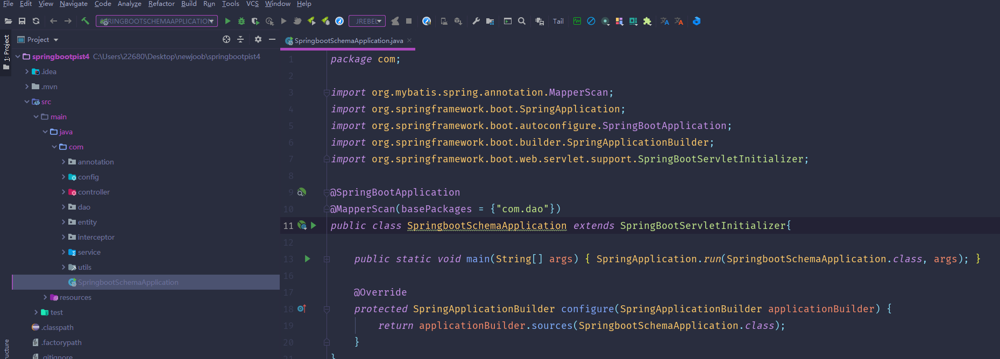

数据库表

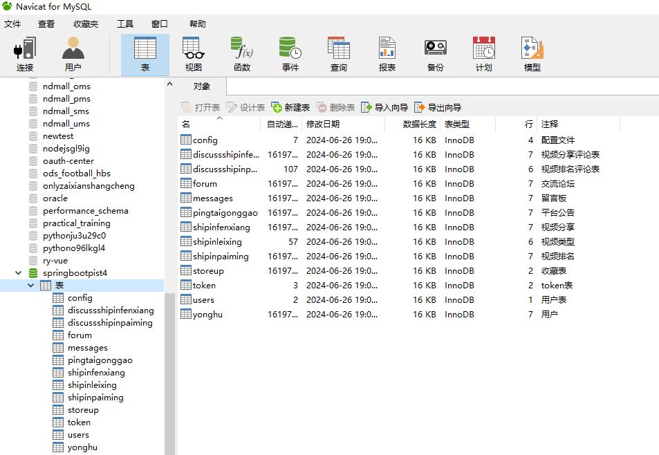

登录

视频分享

视频排名

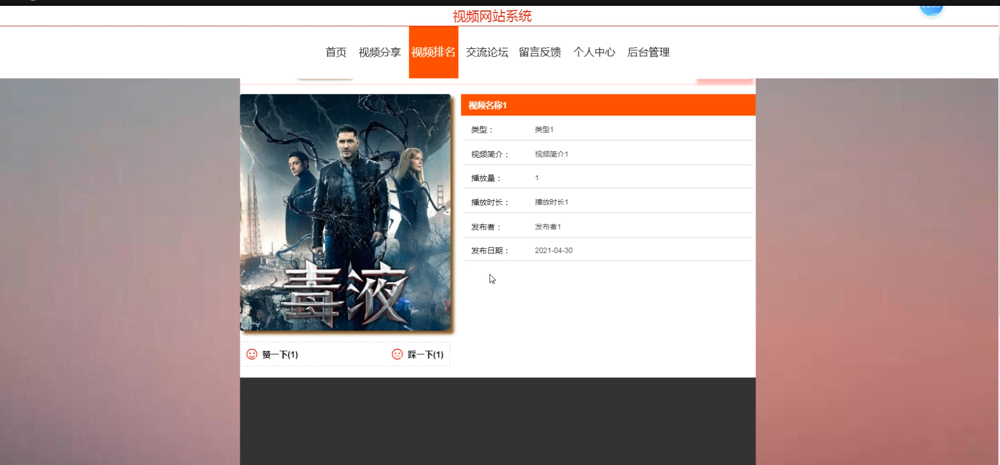

交流论坛

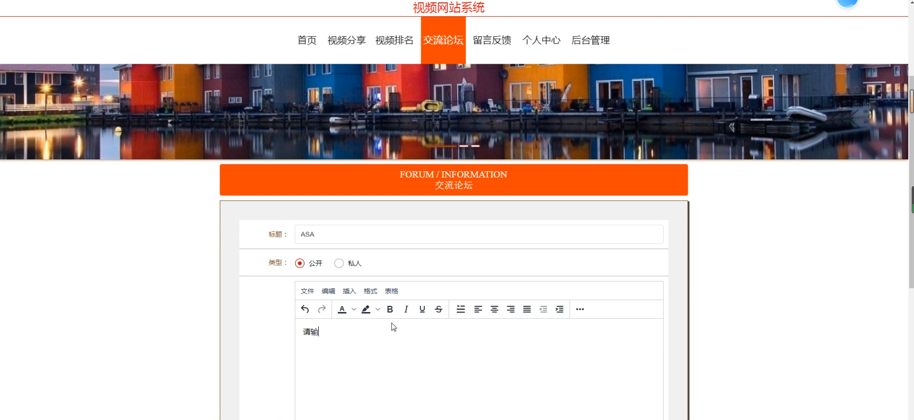

留言反馈

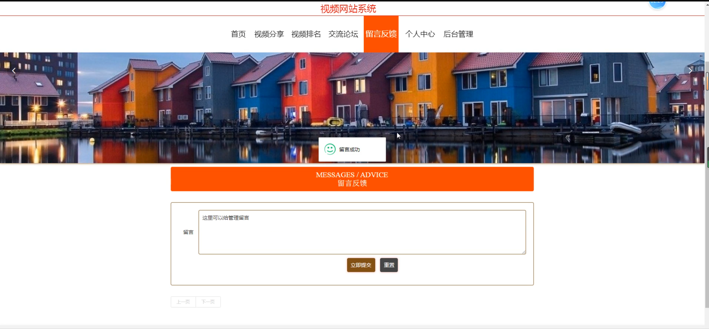

个人中心

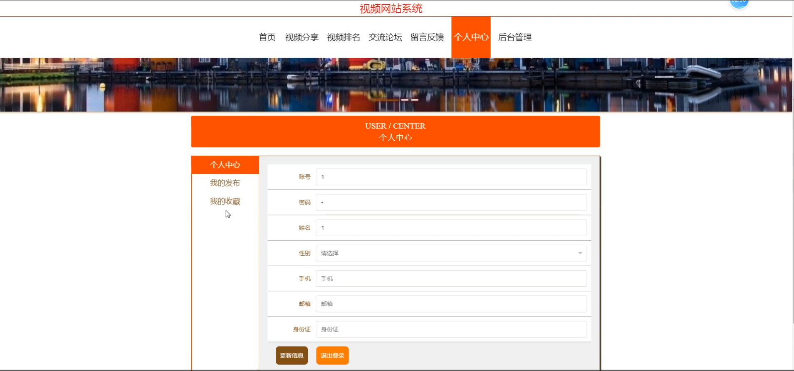

用户端后台管理

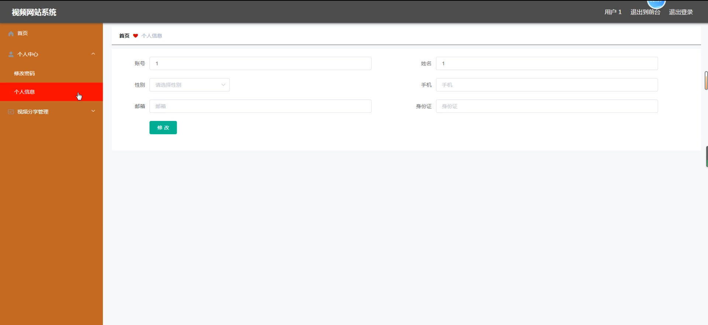

视频分享管理

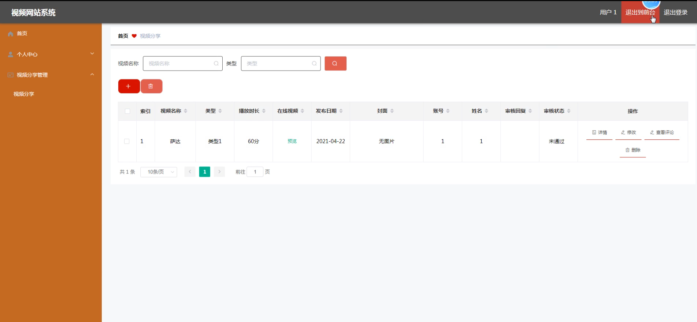

管理端用户管理

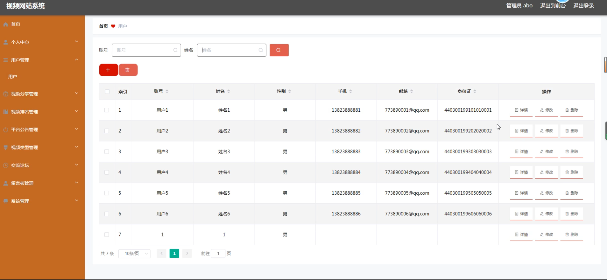

平台公告管理

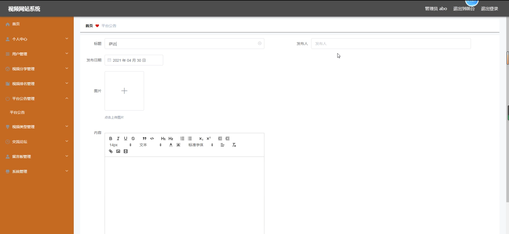

交流论坛管理

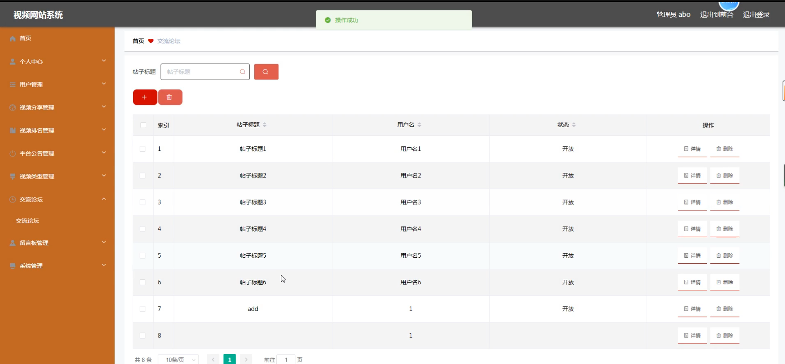

#### 总结

本基于 SpringBoot 的视频网站系统，通过明确的角色分工和全面的功能设置，致力于解决现有视频网站的不足。在为用户提供精彩视频和良好交流环境的同时，为管理员赋予高效管理手段，从而推动视频网站的持续发展，满足用户日益增长的视频娱乐需求，在激烈的市场竞争中占据优势。

#### 使用说明

创建数据库，执行数据库脚本 修改jdbc数据库连接参数 下载安装maven依赖jar 启动idea中的springboot项目

后台地址：http://localhost:8080/springbootpist4/admin/dist/index.html

管理员  abo 密码 abo

前台地址：http://localhost:8080/springbootpist4/front/index.html

